# Match Analyzer

> A high-fidelity tactical intelligence platform that automates the discovery, extraction, and analysis of football match events. By transforming raw event streams from WhoScored into professional-grade analytics, the system delivers deep insights through a 42-metric Gradient Performance Matrix, interactive 2D motion replays for goal build-up, and advanced visualizations for passing networks, territorial penetration, and defensive structures.

---

## Table of Contents

1. [Overview](#overview)
2. [Tech Stack](#tech-stack)
3. [Project Structure](#project-structure)
4. [Stage 1 — Team & Fixture Discovery](#stage-1--team--fixture-discovery)
5. [Stage 2 — WhoScored Event Scraping](#stage-2--whoscored-event-scraping)
6. [Stage 3 — Match Analysis Engine](#stage-3--match-analysis-engine)
7. [Stage 4 — Visualizations](#stage-4--visualizations)
    - [2D Match Replays](#2d-goal-replays)
8. [Stage 5 — Advanced Performance Analytics](#stage-5--advanced-performance-analytics)
9. [Stage 6 — AI Guide](#stage-6--ai-guide-ai-explanations)
10. [Stage 7 — Gradient Performance Matrix](#stage-7--gradient-performance-matrix)
11. [Stage 8 — xG Breakdown](#stage-8--xg-breakdown)
12. [Getting Started](#getting-started)
13. [API Reference](#api-reference)
14. [Configuration](#configuration)

---

## Overview

Match Analyzer is a full-stack football analytics application that takes a team name as input and produces a complete, professional-level tactical breakdown of any recent fixture. The system is split into three clearly defined phases:

- **Discovery** — Search any team by name, retrieve their recent fixtures from WhoScored
- **Scraping** — Extract raw event data (passes, shots, tackles, etc.) from WhoScored's MatchCentre
- **Analysis** — Compute tactical statistics and render interactive visualizations in a React dashboard


---

## Tech Stack

| Layer | Technology |
|---|---|
| **Backend** | Python 3.10+, FastAPI, Uvicorn |
| **Scraping** | `curl_cffi` (browser impersonation), custom HTML parser |
| **Data** | pandas, numpy |
| **Frontend** | React 18, Vite, Vanilla CSS |
| **Charts** | Pure SVG (no D3 dependency) |
| **HTTP** | Axios via a custom `api.js` service layer |

---

## Project Structure

```
match-analyzer/
├── backend/
│   ├── app.py                  # FastAPI application & route definitions
│   ├── run.py                  # Uvicorn entrypoint
│   ├── requirements.txt        # Python dependencies
│   ├── services/
│   │   ├── discovery_service.py   # Stage 1: team lookup & fixture search
│   │   ├── event_scraper.py       # Stage 2: WhoScored event extraction
│   │   └── match_analyzer.py      # Stage 3: all analytics computations
│   ├── scripts/
│   │   ├── test_phase1.py         # Discovery tests
│   │   ├── test_phase2.py         # Scraping tests
│   │   └── test_phase3.py         # Analysis tests
│   └── data/                      # Scraped CSV files (gitignored)
│
├── frontend/
│   ├── index.html
│   ├── vite.config.js
│   ├── src/
│   │   ├── App.jsx                # Top-level routing
│   │   ├── index.css              # Design token system
│   │   ├── components/
│   │   │   ├── HomePage.jsx       # Search UI & fixture results
│   │   │   ├── Dashboard.jsx      # Main match analysis layout
│   │   │   ├── MatchFacts.jsx     # Scoreline & key stats panel
│   │   │   ├── StartingXI.jsx     # Formation & player list
│   │   │   ├── AdvancedMetrics.jsx  # Advanced performance analytics panel
│   │   │   └── views/
│   │   │       ├── ShotMapView.jsx
│   │   │       ├── PassNetworkView.jsx
│   │   │       ├── DefensiveActionsView.jsx
│   │   │       └── ZoneEntriesView.jsx
│   │   └── services/
│   │       └── api.js             # All API calls to FastAPI backend
│
└── viz/                           # Screenshot reference images
```

---

## Stage 1 — Team & Fixture Discovery

**File:** `backend/services/discovery_service.py`

### How It Works

The discovery stage finds recent matches for any club without requiring the user to visit WhoScored directly.

**Step 1 — Team Resolution**

The user types a team name (e.g. `"Arsenal"`, `"Man Utd"`, `"Barcelona"`). The system resolves this to a WhoScored internal team ID and URL slug using a curated lookup table (`KNOWN_TEAMS`) covering 100+ clubs.

Matching is fuzzy — it first tries an exact lookup, then falls back to substring matching, so `"Bayern"` resolves to Bayern Munich just as well as `"Bayern Munich"` does.

```python
KNOWN_TEAMS = {
    "arsenal":        (13,  "England-Arsenal"),
    "man utd":        (32,  "England-Manchester-United"),
    "barcelona":      (65,  "Spain-Barcelona"),
    "psg":            (304, "France-Paris-Saint-Germain"),
    # ... 100+ teams
}
```

**Step 2 — WhoScored Fixtures Page Fetch**

The service uses `curl_cffi` to impersonate a Chrome 120 browser, bypassing WhoScored's bot detection. It visits:

```
https://www.whoscored.com/Teams/{team_id}/Fixtures/{team_slug}
```

The HTML embeds fixture data inside a JavaScript `require.config.params['args'].fixtureMatches` array. The parser uses a bracket-depth tracker to extract this raw JSON without a headless browser.

**Step 3 — Fixture Parsing & Filtering**

Each row in `fixtureMatches` is decoded to extract:
- Home/away team names
- Match date (converted from `DD-MM-YY` to ISO `YYYY-MM-DD`)
- Competition name and season
- WhoScored match URL (constructed from match ID + slug)
- Whether the match has been played (`has_matchcentre = status in {"FT", "AET", "PEN"}`)

Optional filters: season (e.g. `"2024/2025"`), competition (e.g. `"Premier League"`), and played-only toggle.

**Frontend — Search UI**

The `HomePage` component renders a search bar. The user types a team name and hits search. The frontend calls `GET /api/search?team=Arsenal` and displays a card list of recent fixtures. Clicking a fixture loads the match dashboard.

---

## Stage 2 — WhoScored Event Scraping

**File:** `backend/services/event_scraper.py`

### How It Works

Once the user selects a fixture (either from the search results or by pasting a WhoScored MatchCentre URL directly), the scraper extracts the full event stream from WhoScored's live match centre.

**Step 1 — URL Input**

The user provides the WhoScored MatchCentre URL, for example:
```
https://www.whoscored.com/Matches/1821234/Live/England-Premier-League-2024-2025-Arsenal-vs-Man-Utd
```

**Step 2 — Browser Impersonation**

Using `curl_cffi` with `impersonate="chrome120"`, the scraper fetches the match page. The impersonation mirrors the TLS fingerprint, HTTP/2 settings, and UA headers of a real Chrome browser, bypassing Cloudflare and WhoScored's anti-bot systems without relying on Selenium or Playwright.

**Step 3 — Event Data Extraction**

WhoScored embeds the full event feed in the page's JavaScript. The scraper locates and extracts the `matchCentreData` object, which contains:
- `events[]` — every on-ball event (Pass, Shot, Tackle, Foul, etc.)
- `home` / `away` team metadata
- Formation and lineup data

**Step 4 — Event Normalization**

Each raw event is normalized into a flat row with 50+ enriched Boolean feature columns:

| Column | Description |
|---|---|
| `type` | Event type: `Pass`, `Goal`, `SavedShot`, `Tackle`, etc. |
| `minute` / `second` | Match time |
| `x` / `y` | Pitch coordinates (0–100 scale) |
| `endX` / `endY` | End coordinates for passes/carries |
| `team` | Team name |
| `playerName` | Player who performed the action |
| `outcomeType` | `Successful` or `Unsuccessful` |
| `is_goal` | Boolean: was this a goal? |
| `is_own_goal` | Boolean: own goal? |
| `is_key_pass` | Boolean: directly led to a shot? |
| `is_big_chance` | Boolean: high-xG opportunity? |
| `is_cross` | Boolean: crossing action? |
| `is_long_ball` | Boolean: long direct pass? |
| `is_through_ball` | Boolean: through ball? |
| `is_progressive_pass` | Float: yards toward goal (positive = progressive) |
| `is_progressive_carry` | Float: yards toward goal via carry |
| `is_box_entry_pass` | Boolean: pass completing a box entry |
| `is_box_entry_carry` | Boolean: carry completing a box entry |
| `is_final_third_entry_pass` | Boolean: pass completing final third entry |
| `is_gk_save` | Boolean: goalkeeper save? |
| `is_yellow_card` | Bool: yellow card event |
| `is_red_card` | Bool: straight red |
| `pitch_zone` | Zone label: `"left-wing"`, `"central-midfield"`, etc. |
| `depth_zone` | Depth label: `"defensive-third"`, `"middle-third"`, `"final-third"` |
| `xT` | Expected Threat value for the action |

**Step 5 — CSV Persistence**

The normalized events are saved as:
```
backend/data/whoscored_{HomeTeam}_vs_{AwayTeam}_all_events.csv
```

This CSV becomes the single source of truth for all downstream analysis. Every visualization and metric is computed directly from this file — no database required.

---

## Stage 3 — Match Analysis Engine

**File:** `backend/services/match_analyzer.py`

The analytics engine reads the saved CSV and computes every metric through a series of independent functions. Each function is exposed as a dedicated FastAPI endpoint.

### Own Goal Correction

A key data integrity fix: WhoScored records own goals under the team that committed them with `is_own_goal=True`. The engine corrects the scoreline before any stat is computed:

```python
home_score = raw_home_goals - og_home_committed + og_away_committed
away_score = raw_away_goals - og_away_committed + og_home_committed
```

### Analytics Functions

| Function | Endpoint | Description |
|---|---|---|
| `get_match_summary` | `/match/{id}/summary` | Scoreline, shots, SOT, fouls, corners, possession, pass accuracy |
| `get_starting_xi` | `/match/{id}/starting-xi` | Lineups with formation positions |
| `get_shot_map` | `/match/{id}/shots` | All shots with coordinates, xG proxy, outcome |
| `get_pass_network` | `/match/{id}/pass-network` | Average positions + weighted pass links between players |
| `get_defensive_actions` | `/match/{id}/defensive-actions` | Tackles, interceptions, clearances per zone |
| `get_zone_entries` | `/match/{id}/zone-entries` | Final third entries, Zone 14 entries, box entries, through balls, and touches in the opposition box — all segmented by pass/carry |
| `get_average_shape` | `/match/{id}/average-shape` | Average in-possession tactical shape per player |
| `get_ppda` | `/match/{id}/ppda` | Pressing intensity per half |
| `get_xT_momentum` | `/match/{id}/momentum` | Rolling Expected Threat (xT) timeline showing match dominance |
| `get_goal_build_ups` | `/match/{id}/goal-build-ups` | Full event sequences for all open-play goals |
| `get_set_piece_analysis` | `/match/{id}/set-pieces` | Corner and free-kick delivery & outcome analysis |
| `get_advanced_metrics` | `/match/{id}/advanced-metrics` | Comprehensive tactical metrics panel |
| `get_gradient_scoring` | `/match/{id}/gradient-scoring` | 42-variable index scoring breakdown out of 100 |

---

## Stage 4 — Visualizations

All visualizations are built in pure SVG rendered by React components, matching a consistent dark-mode design system (`#111827` pitch, `rgba(255,255,255,0.25)` lines).

### 2D Goal Replays

A full broadcast-style interactive replay engine that automatically reconstructs the build-up sequence leading to every open-play goal.
Features dynamic half-time coordinate mirroring so teams attack the correct physical goal-mouth based on the match period, and full event-chain tracing (from deep phases or corners all the way to the final strike). Click **"Play"** to watch the tactical sequence unfold with animated passing lanes, positional markers, and ball flight paths.

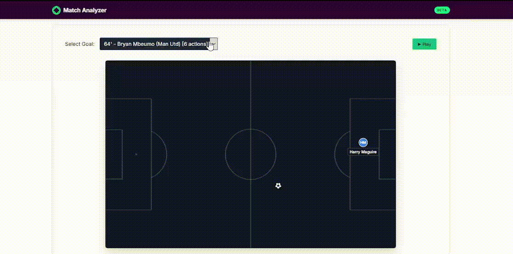

---

### Match Facts

Displays the corrected scoreline, key event timeline, and a side-by-side stat comparison (shots, saves, possession, pass accuracy, fouls, corners, big chances).

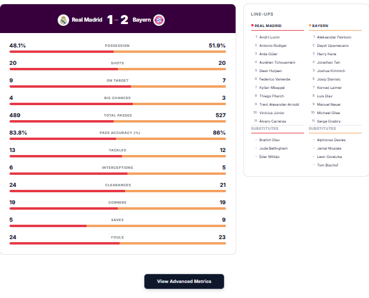

---

### Shot Map

Every shot attempt plotted on a half-pitch, sized by xG proxy (distance from goal, angle, header flag), colored by outcome:
- **Green glow** — Goal
- **Blue** — Shot on target (saved)
- **Gray** — Off-target / blocked

Clicking a shot displays a floating tooltip with player name, minute, xG proxy distance, body part (Header/Left Foot/Right Foot), and shot origin context (e.g., Open Play, Penalty, From Corner).

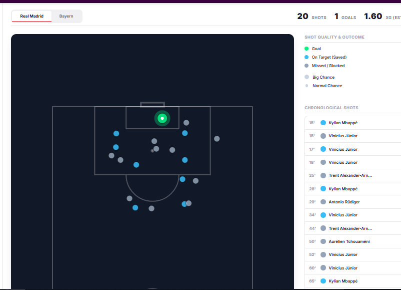

---

### Pass Network

A directed graph overlaid on the pitch showing average player positions as nodes and the most frequent passing combinations as weighted edges. The thicker the line, the more passes exchanged between those two players in the match. Hovering a player highlights all their connections and fades the rest.

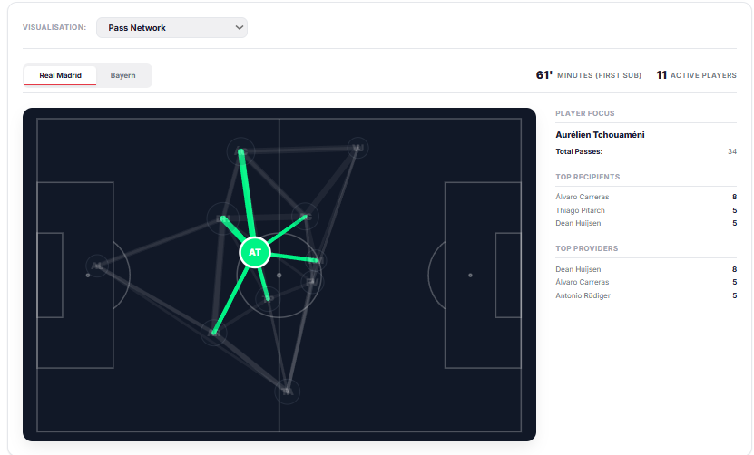

---

### Tactical Shape

Maps the average in-possession shape of the team. This visualization is generated with strict tactical fidelity by aggressively filtering out all set pieces, kick-offs, penalties, and post-set-piece scrambles. Nodes accurately reflect ball interactions. Substitutes are clearly delineated as ghost nodes, preventing them from skewing the primary XI structure. Interactive tooltips reveal individual touch volumes and passing involvement.

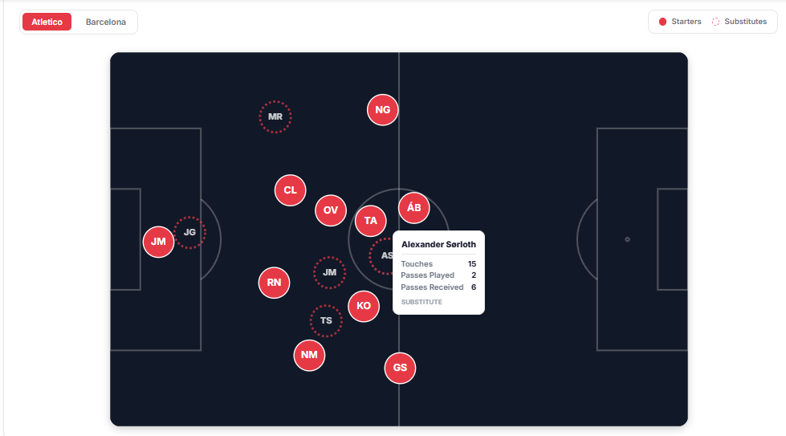

---

### Defensive Actions

Tackles, interceptions, and clearances plotted on a full pitch, grouped by pitch zone. Helps identify where each team wins the ball back most frequently. The median **Defensive Line** is calculated exclusively from open-play defensive actions, filtering out set-piece congestion to accurately reflect open-play pressing height.

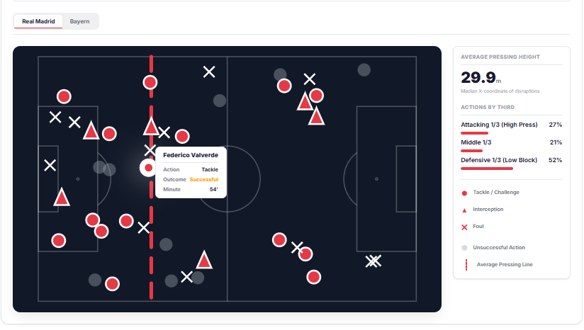

---

### Creative Play

A unified tactical intelligence panel that analyses how each team penetrates and operates in dangerous areas — exclusively from open play. Organised into five interactive sub-tabs with a **Pass / Carry filter toggle** available on all entry views:

| Sub-tab | Description |
|---|---|
| **Final Third Entries** | Open-play passes and carries that cross the final third boundary (x ≥ 67), shown as directional vectors with arrowheads |
| **Zone 14 Entries** | Entries into the central Zone 14 pocket (x: 72–83, y: 30–70) — the highest-value zone for shot creation |
| **Box Entries** | Open-play passes and carries whose endpoint falls inside the attacking penalty area (x > 83, y: 21–79) |
| **Through Balls** | Progressive line-breaking passes, with successful attempts shown as solid lines and failed attempts as dashed red lines |
| **Box Touches** | Scatter-plot of every on-ball touch inside the opposition penalty box. Goals glow green, shots are highlighted in amber, all other touches rendered as team-coloured dots |

All tabs feature a **Top Penetrators** sidebar ranking each player by successful entries or touches. Hovering any vector or dot reveals a tooltip with player name, action type, match minute, and outcome.

#### Final Third Entries
<p align="center">
  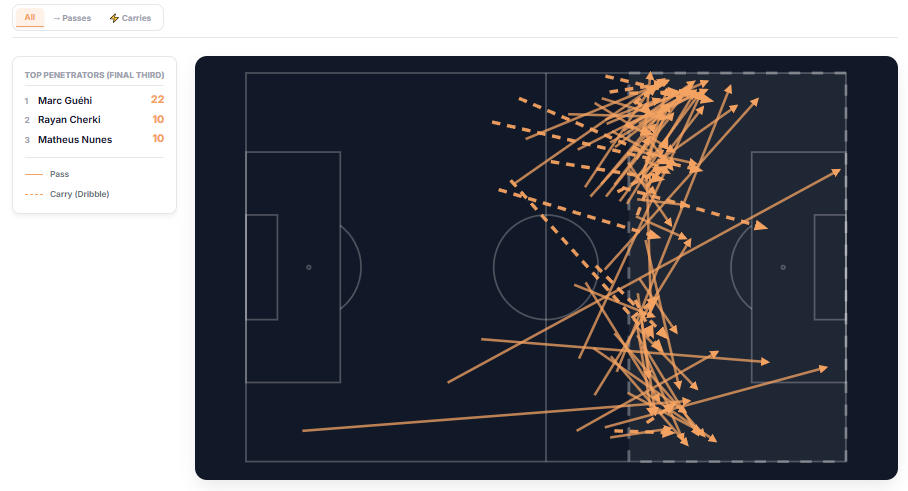
  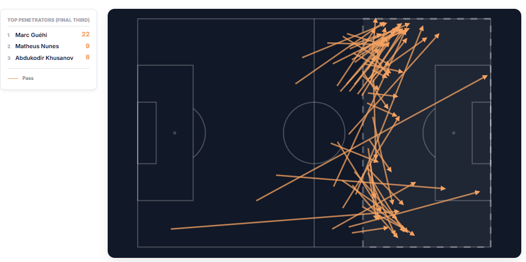
  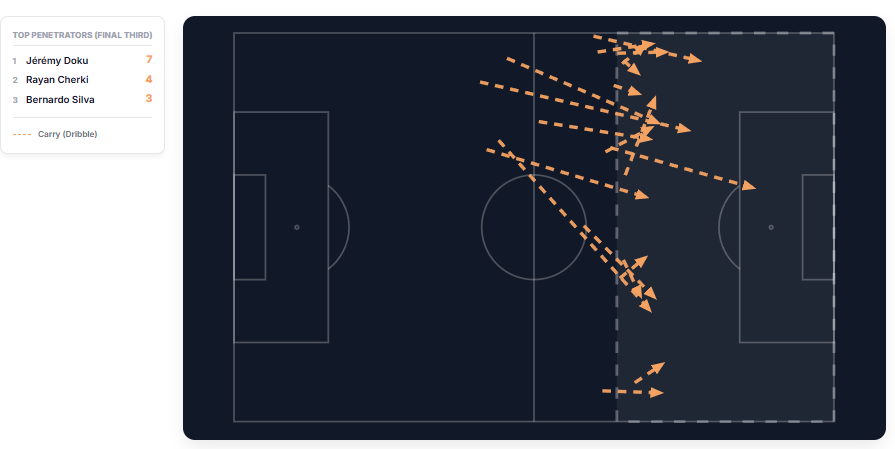
</p>

#### Zone 14 Entries
<p align="center">
  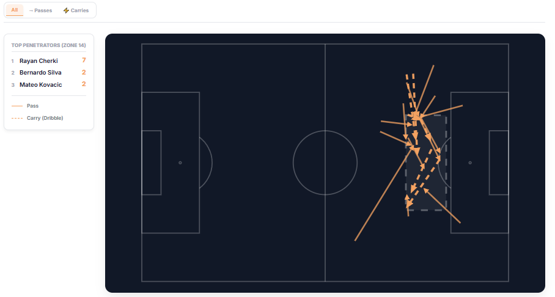
  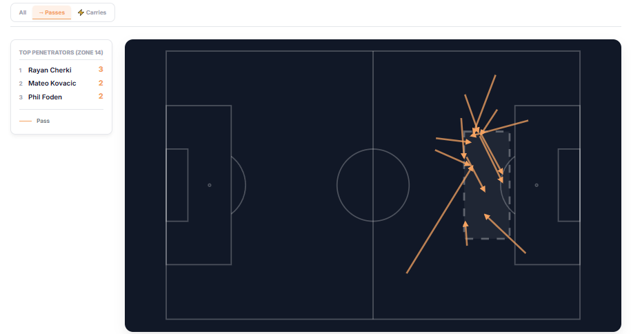
  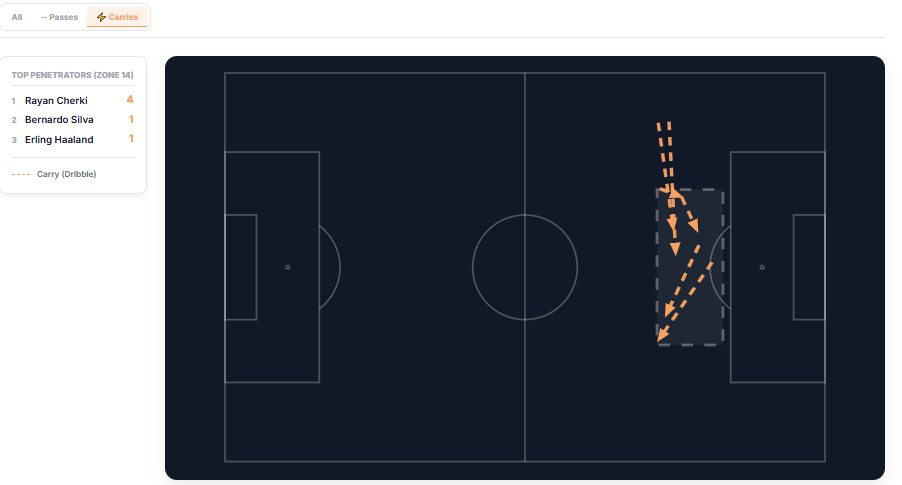
</p>

#### Box Entries
<p align="center">
  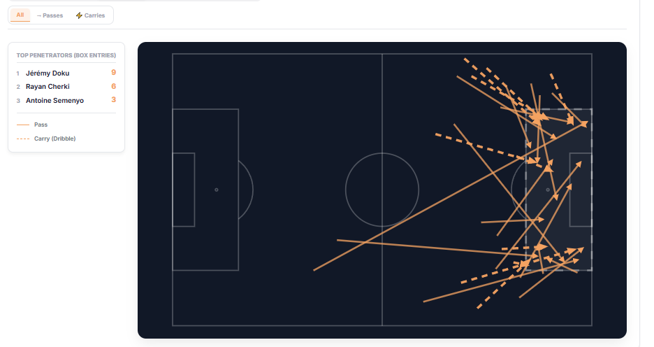
  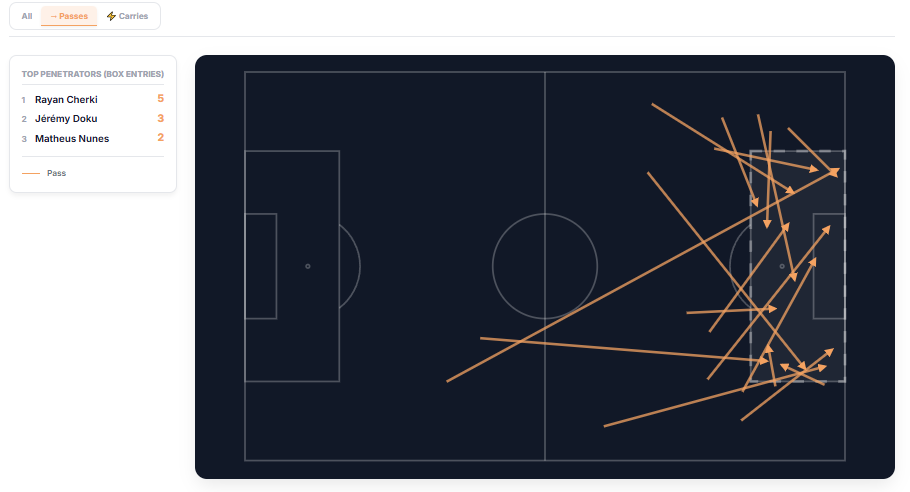
  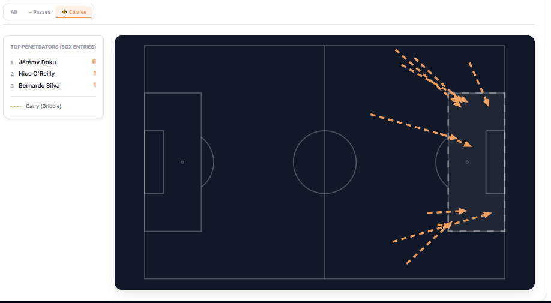
</p>

#### Through Balls & Box Touches
<p align="center">
  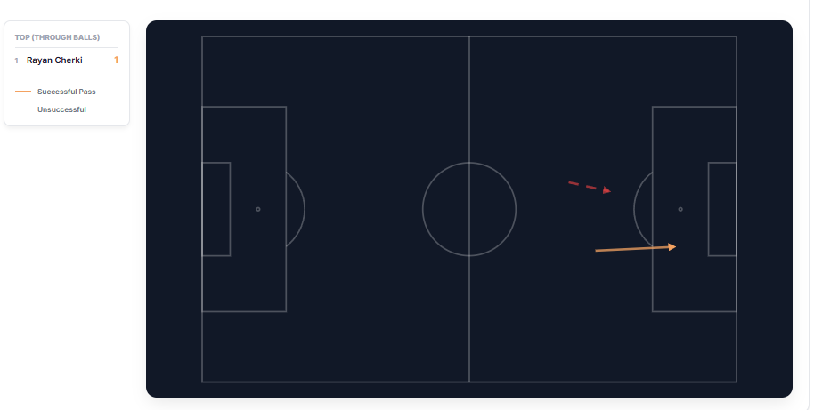
  
</p>

---

### Set Pieces

Comprehensive mapping of Corner and Free Kick deliveries, tracking player execution, first-contact win rates, and subsequent shot outcomes. Evaluates set-piece danger against open-play production through a robust analytics summary block.

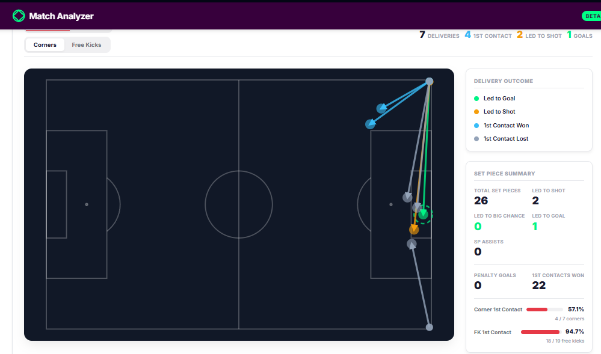
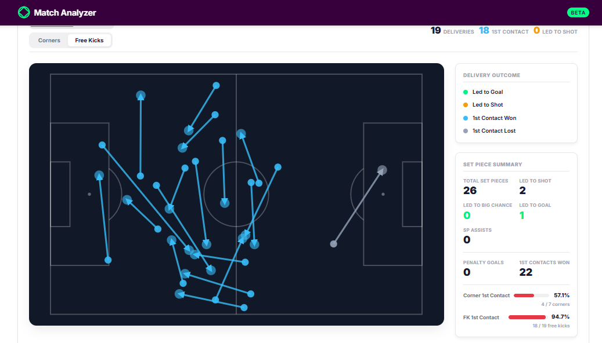

---

### Momentum

Displays a rolling action-density timeline, visualizing the flow of the match over 90 minutes. Highlights periods of sustained dominance or momentum shifts based on passing and attacking actions.

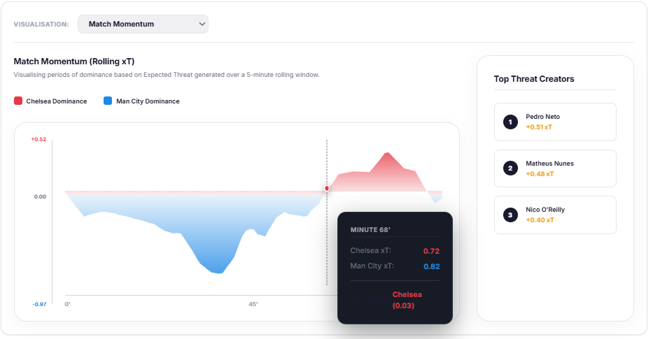

---

### Pressing

Visualizes the defensive pressure applied by each team. Calculates Passes Per Defensive Action (PPDA) by half, showing where and when teams apply a high press or drop into a lower block.

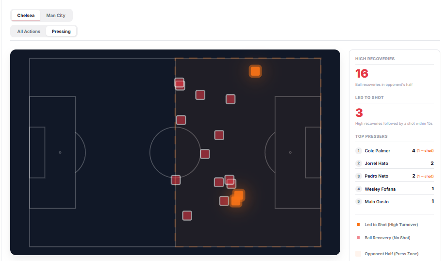

---

## Stage 5 — Advanced Performance Analytics

**Component:** `frontend/src/components/AdvancedMetrics.jsx`

A comprehensive data panel that provides a side-by-side comparison of 13 advanced metrics across 7 tactical categories. The view utilizes intuitive indicators (**▲ green** for better, **▼ red** for worse) to highlight performance deltas between the two teams.

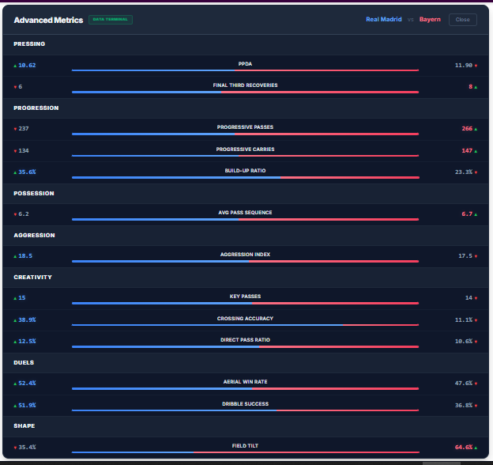

### Metrics Computed

#### Pressing
| Metric | Formula |
|---|---|
| **PPDA** | Opponent passes in their own 60% ÷ Team defensive actions in opp 60%. *Lower = more aggressive press* |
| **Final Third Recoveries** | Count of `BallRecovery` events where `x ≥ 67` (attacking third) |

#### Progression
| Metric | Formula |
|---|---|
| **Progressive Passes** | Count of passes where `prog_pass > 0` (positive = ball moved toward goal) |
| **Progressive Carries** | Count of carries where `prog_carry > 0` |
| **Build-up Ratio** | Own-third passes (`x < 33`) ÷ total passes × 100%. *Higher = more patient build-up* |

#### Possession
| Metric | Formula |
|---|---|
| **Avg Pass Sequence** | Average length of consecutive passing sequences before possession is lost |

#### Aggression
| Metric | Formula |
|---|---|
| **Aggression Index** | `(Tackles + Fouls) / 2` — composite physical intensity indicator |

#### Creativity
| Metric | Formula |
|---|---|
| **Key Passes** | Count of `is_key_pass == True` events |
| **Crossing Accuracy** | Successful crosses (`is_cross` + `outcomeType == Successful`) ÷ total crosses × 100% |
| **Direct Pass Ratio** | `(is_long_ball + is_through_ball)` ÷ total passes × 100% |

#### Duels
| Metric | Formula |
|---|---|
| **Aerial Win Rate** | Successful `Aerial` events ÷ total aerial duels × 100% |
| **Dribble Success** | Successful `TakeOn` events ÷ total take-ons × 100% |

#### Shape
| Metric | Formula |
|---|---|
| **Field Tilt** | Team's final-third passes ÷ total final-third passes by both teams × 100%. *A 60%+ tilt indicates sustained territorial dominance* |
  
---

## Stage 6 — AI Guide (✦ AI Explanations)

**Component:** `frontend/src/components/AIGuide.jsx` | **Service:** `backend/services/explain_service.py`

Each visualization and analytics panel includes a **✦ AI Guide** button. Clicking it opens a contextual explanation powered by Groq's LLM that analyzes *this specific match's* performance in ~130 words:

- **What it shows**: How to read the visualization and what metrics matter
- **Match analysis**: Real numbers and player names — what was the team's actual performance, what stood out, does it match the result?

**Supported explanations:**
- Shot Maps, Pass Networks, Momentum, Defensive Actions, Zone Entries, Set Pieces, Average Shape
- Gradient Scoring (with detailed sub-score breakdown)
- Advanced Metrics

**Requirements:** `GROQ_API_KEY` in `backend/.env` (optional; all other features work without it)

---

## Stage 7 — Gradient Performance Matrix

**Component:** `frontend/src/components/GradientScoring.jsx`

The platform’s standout analytical feature: a 42-metric mathematical model that generates a "Tactical Fingerprint" for each team. Unlike standard box scores, the Gradient Scoring engine prioritizes territorial dominance (Field Tilt) and pressing efficiency (PPDA) over raw shot volume.

### Visual Breakdown

The matrix provides a high-level summary followed by deep-dive tactical pillars for **Attacking**, **Possession**, and **Defense**.

#### Performance Matrix
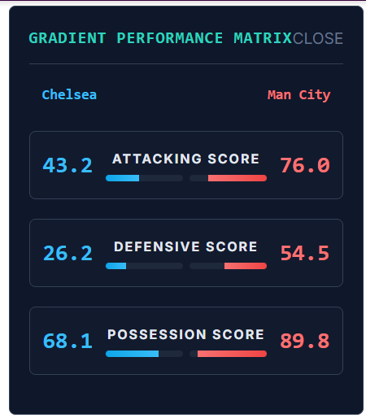

#### Tactical Pillars Breakdown
<p align="center">
  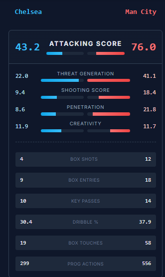
  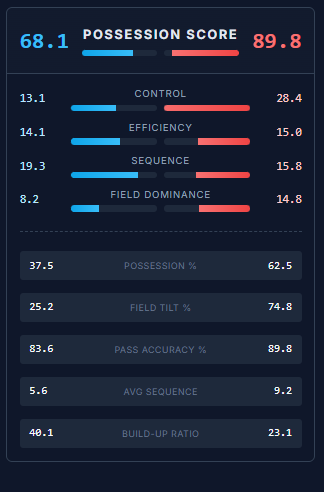
  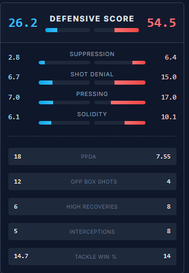
</p>

### Mathematical Model Breakdown

Each category is powered by 14 distinct performance vectors (42 total), weighted to accurately reflect match dominance.

#### 1. Attacking Score (14 Metrics)
Measures the efficiency and threat of a team's offensive phases.
*   **Threat Generation**: Weighted Progressive Passes, Progressive Carries, and Corner volume.
*   **Shooting Efficiency**: Shots from inside the box, Shot-on-Target %, Average Shot Distance (normalized for proximity), and pure goals.
*   **Penetration**: Successful entries into the Penalty Box and Zone 14, and touches in the opposition box.
*   **Creativity**: Key Pass volume (shot assists) and Crossing Accuracy.

**Formula:**
```python
# big_chances uses WhoScored's is_big_chance flag (fallback: box_shots * 0.4)
att_score = (
    min(prog_p/60, 1) * 7 + min(prog_c/45, 1) * 3 + min(big_chances/8, 1) * 5 + min(corners/10, 1) * 5 +
    min(box_shots/12, 1) * 10 + min(sot_pct/40, 1) * 5 + max(0, min((28-avg_dist)/15, 1)) * 5 + min(goals/3, 1) * 10 +
    min(box_entries/22, 1) * 15 + min(z14_entries/16, 1) * 5 + min(box_touches/28, 1) * 10 + min(deep_progs/12, 1) * 5 +
    min(kp/12, 1) * 10 + min(cross_acc/30, 1) * 5
)
```

#### 2. Possession Score (14 Metrics)
Measures match control and build-up quality.
*   **Control**: Overall Possession % and **Field Tilt** (final-third pass share).
*   **Efficiency**: General Pass Accuracy, Forward Pass Accuracy, and Own-Half security.
*   **Sequence**: Average Pass Sequence length and Build-up Ratio (own-third usage).
*   **Field Dominance**: Absolute volume and accuracy of passes within the final third.

**Formula:**
```python
poss_score = (
    min(poss_pct/63, 1) * 15 + min(field_tilt/63, 1) * 15 + min(pass_vol/500, 1) * 5 +
    min(pass_acc/90, 1) * 10 + min(fwd_acc/80, 1) * 5 + min(own_acc/95, 1) * 5 +
    min(avg_seq/5, 1) * 10 + min(buildup/40, 1) * 10 +
    min(len(ft_passes)/165, 1) * 10 + min(ft_acc/80, 1) * 5 +
    min(recovs/60, 1) * 5 + max(0, 5 - (losses/60))
)
```

#### 3. Defensive Score (14 Metrics)
Measures the ability to suppress opponent play and maintain solidity.
*   **Suppression**: Ability to limit opponent progressive actions and box entries.
*   **Shot Denial**: Ability to limit opponent box shots and force high average shot distances.
*   **Pressing Intensity**: **PPDA** (Passes Per Defensive Action) and Final-Third ball recoveries.
*   **Solidity**: Dribble defense (Tackles vs Take-ons), Aerial Win %, and high-volume defensive actions (Blocks, Interceptions, Clearances).

**Formula:**
```python
def_score = (
    max(0, 20 - opp_prog * 0.09) + max(0, 10 - max(0, opp_box_ent - 5) * 0.18) +
    max(0, 10 - max(0, opp_box_shots - 2) * 0.38) + max(0, 10 - (opp_sot_pct * 0.15)) + min(opp_dist/25, 1) * 10 +
    max(0, 10 - max(0, ppda - 8) * 0.35) + min(high_recov/12, 1) * 10 +
    min(def_duels/70, 1) * 5 + min(aerial_pct/65, 1) * 5 +
    min(tackles/25, 1) * 3 + min(inters/15, 1) * 3 + min(clears/30, 1) * 2 + min(blocks/10, 1) * 2
)
```

### Directional Play Correction
The engine automatically detects each team's attacking direction (x > 50 vs x < 50) by analyzing their average shot coordinates. This ensures that "Box Entries" and "Field Tilt" are accurately calculated even when WhoScored data varies its coordinate normalization between matches.

### Calibration Notes

Thresholds are set to realistic elite-level performance so that strong displays score 75–90 and average displays score 50–70 — scores reflect genuine tactical quality rather than raw event volume.

**Attacking:** `big_chances` (WhoScored's `is_big_chance` flag) replaces the naive `shots × 0.12` xG estimate. Thresholds calibrated to elite-but-achievable values — e.g. 22 box entries, 12 key passes, 30% crossing accuracy.

**Defense:** Suppression uses a simple proportional formula `max(0, 20 - opp_prog × 0.09)` that reaches zero only at 222 progressive actions (extreme), giving realistic credit across the normal 60–120 range. Box shots allowed uses a grace-zone model (`opp_box_shots - 2`) before deductions begin.

**Passing:** Five caps lowered to match real match distributions — possession (70% → 63%), field tilt (75% → 63%), pass volume (700 → 500), avg sequence (6 → 5), final-third pass volume (250 → 165). Loss penalty normalised over 60 events instead of 40.

**Breakdown accuracy:** All 14 attacking metrics appear in breakdown sub-categories, all values are properly clamped (no negatives, no over-cap inflation).

---

## Stage 8 — xG Breakdown

**Component:** `frontend/src/components/XGBreakdown.jsx` | **Service:** `backend/services/xg_service.py` | **Model:** `backend/xg-model/my-xG-model/`

A full Expected Goals (xG) engine powered by a trained XGBoost classifier. Unlike the simple xG proxy used in the Shot Map (distance + angle only), this model was trained on real match event data and incorporates a richer set of features — producing calibrated shot probabilities that closely match professional xG models.

### The Model

The XGBoost classifier (`xgb_xg_model.json`) was trained in Google Colab on a dataset of thousands of shots drawn from league match event streams. Training was performed with early stopping (`best_iteration = 107`) to prevent overfitting.

**Features used for each shot:**

| Feature | Description |
|---|---|
| `distance` | Euclidean distance to goal centre (metres) |
| `angle_deg` | Angle subtended between both posts from the shot position |
| `log_distance` | Log-transformed distance (compresses extreme range values) |
| `is_header` | Headed attempt |
| `is_volley` | Volley attempt |
| `is_left_foot` / `is_right_foot` | Foot used |
| `is_fast_break` | Shot taken on a counter-attack |
| `is_big_chance` | WhoScored's high-quality chance flag |
| `is_assist_throughball` | Preceded by a through ball |
| `is_assist_cross` | Preceded by a cross |
| `is_assist_corner` | Preceded by a corner |
| `is_assist_freekick` | Preceded by a free kick |

Assist context is backfilled from the pass event immediately preceding each shot (looking back up to 5 events), replicating exactly the logic from the training notebook. Distance and angle are clipped to the same bounds used during training (`xg_clip_values.pkl`) to prevent out-of-distribution inference.

**Penalties** are excluded from model inference and assigned a fixed xG of **0.76** (the empirical conversion rate). **Own goals** are displayed in the breakdown with xG = 0 and credited to the benefiting team.

### What's Shown

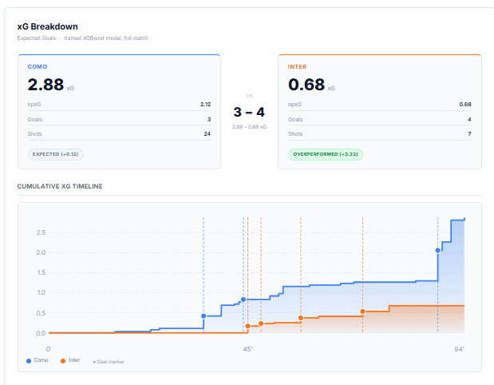

The summary cards show each team's total xG, non-penalty xG (npxG), goals, and shots — alongside an overperformance/underperformance badge comparing goals scored to xG generated. The cumulative xG timeline plots how scoring threat built throughout the match, with goal markers overlaid at each actual goal moment.

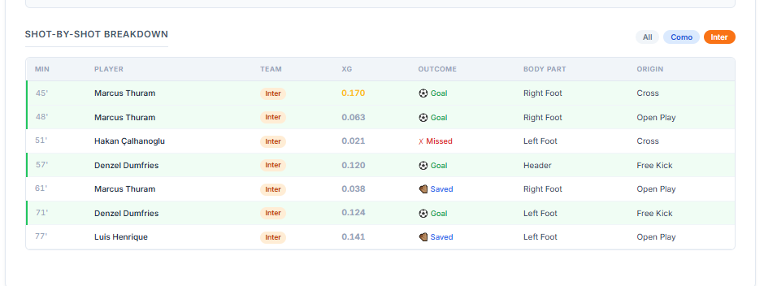

The shot-by-shot table lists every attempt in chronological order with player, minute, xG value, outcome, body part, and origin. A **team filter** (All / Home / Away) lets you isolate each side's shot profile instantly.

### Endpoint

```
GET /api/match/{match_id}/xg-breakdown
```

Returns `summary`, `timeline`, `shots`, and `performance` keys. Consumed by the `XGBreakdown` component via `fetchXGBreakdown()` in `api.js`.

---

## Getting Started

### Prerequisites

- Python 3.10+
- Node.js 18+
- npm

### Environment Variables

Copy `backend/.env.example` to `backend/.env` and fill in your key:

```bash
cp backend/.env.example backend/.env
```

| Variable | Required | Purpose |
|---|---|---|
| `GROQ_API_KEY` | Optional | Powers the **✦ AI Guide** feature (per-visualization explanations). Get a free key at [console.groq.com](https://console.groq.com). All other analytics features work without it. |

### Backend Setup

```bash
cd backend

# Create and activate virtual environment
python -m venv .venv
.venv\Scripts\activate          # Windows
# source .venv/bin/activate     # macOS/Linux

# Install dependencies
pip install -r requirements.txt

# Start the API server
python run.py
# Server runs at http://localhost:8000
```

### Frontend Setup

```bash
cd frontend

# Install dependencies
npm install

# Start the dev server
npm run dev
# App runs at http://localhost:5173
```

### Using the App

1. Open `http://localhost:5173` in your browser
2. Type a team name in the search bar (e.g. `Arsenal`, `Real Madrid`, `PSG`)
3. Select a match from the fixture list
4. The scraper fetches live data from WhoScored (~30–60 seconds)
5. The dashboard loads automatically once data is saved
6. Switch between visualizations via the dropdown
7. Click **"View Advanced Metrics"** to open the data terminal

> **Note:** WhoScored scraping relies on browser impersonation. If you encounter 403 errors, wait a few minutes and try again. Avoid scraping the same match repeatedly in quick succession.

---

## API Reference

All endpoints are prefixed with `/api`.

| Method | Endpoint | Description |
|---|---|---|
| `GET` | `/search?team={name}` | Search fixtures for a team |
| `POST` | `/scrape` | Scrape events for a WhoScored URL |
| `GET` | `/matches` | List all locally saved matches |
| `GET` | `/match/{id}/summary` | Match facts & scoreline |
| `GET` | `/match/{id}/starting-xi` | Lineups |
| `GET` | `/match/{id}/shots` | Shot map data |
| `GET` | `/match/{id}/pass-network` | Pass network graph |
| `GET` | `/match/{id}/defensive-actions` | Defensive action heatmap |
| `GET` | `/match/{id}/zone-entries` | Creative Play data — final third entries, Zone 14 entries, box entries, through balls, and opposition box touches |
| `GET` | `/match/{id}/set-pieces` | Set piece analysis (Corners & Free Kicks) |
| `GET` | `/match/{id}/average-shape` | Average tactical in-possession shape |
| `GET` | `/match/{id}/momentum` | Match momentum timeline |
| `GET` | `/match/{id}/goal-build-ups` | Open-play goal sequence coordinates |
| `GET` | `/match/{id}/ppda` | PPDA by half |
| `GET` | `/match/{id}/advanced-metrics` | Full advanced metrics terminal |
| `GET` | `/match/{id}/gradient-scoring` | Gradient performance matrix score |
| `GET` | `/match/{id}/xg-breakdown` | Full xG breakdown — summary, timeline, shot list |

Interactive API docs available at `http://localhost:8000/docs` (Swagger UI).

---

## Configuration

The backend reads all match data from `backend/data/`. No database or external service is required beyond WhoScored access.

To add a new team to the discovery lookup, add it to `KNOWN_TEAMS` in `discovery_service.py`:
```python
"new team name": (whoscored_team_id, "Country-Team-Slug"),
```

Team IDs can be found in the WhoScored URL when browsing any team's page:  
`https://www.whoscored.com/Teams/`**`{team_id}`**`/Fixtures/{slug}`

---

## License

MIT
