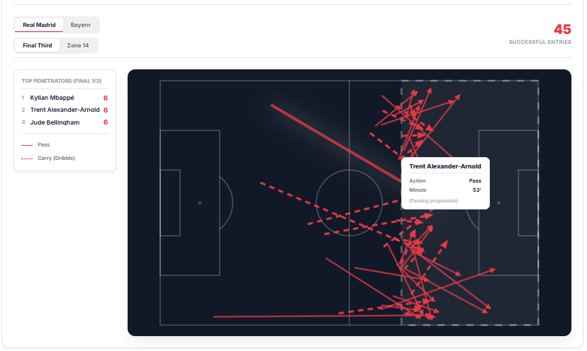
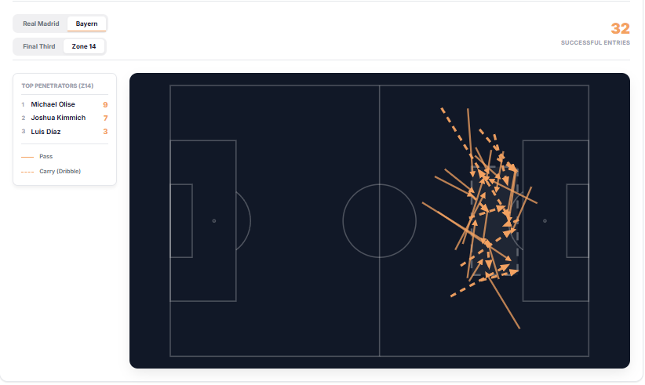

# Match Analyzer

> A professional-grade football match analysis platform that searches for any fixture, scrapes live event data from WhoScored, and renders a fully interactive tactical dashboard — shot maps, pass networks, zone entry flows, defensive heatmaps, and a Bloomberg-style advanced metrics terminal.

---

## Table of Contents

1. [Overview](#overview)
2. [Tech Stack](#tech-stack)
3. [Project Structure](#project-structure)
4. [Stage 1 — Team & Fixture Discovery](#stage-1--team--fixture-discovery)
5. [Stage 2 — WhoScored Event Scraping](#stage-2--whoscored-event-scraping)
6. [Stage 3 — Match Analysis Engine](#stage-3--match-analysis-engine)
7. [Stage 4 — Visualizations](#stage-4--visualizations)
8. [Stage 5 — Advanced Metrics Terminal](#stage-5--advanced-metrics-terminal)
9. [Getting Started](#getting-started)
10. [API Reference](#api-reference)
11. [Configuration](#configuration)

---

## Overview

Match Analyzer is a full-stack football analytics application that takes a team name as input and produces a complete, professional-level tactical breakdown of any recent fixture. The system is split into three clearly defined phases:

- **Discovery** — Search any team by name, retrieve their recent fixtures from WhoScored
- **Scraping** — Extract raw event data (passes, shots, tackles, etc.) from WhoScored's MatchCentre
- **Analysis** — Compute tactical statistics and render interactive visualizations in a React dashboard

The platform covers top-flight clubs across the Premier League, La Liga, Serie A, Bundesliga, and Ligue 1.

---

## Tech Stack

| Layer | Technology |
|---|---|
| **Backend** | Python 3.10+, FastAPI, Uvicorn |
| **Scraping** | `curl_cffi` (browser impersonation), custom HTML parser |
| **Data** | pandas, numpy |
| **Frontend** | React 18, Vite, Vanilla CSS |
| **Charts** | Pure SVG (no D3 dependency) |
| **HTTP** | Axios via a custom `api.js` service layer |

---

## Project Structure

```
xG-app/
├── backend/
│   ├── app.py                  # FastAPI application & route definitions
│   ├── run.py                  # Uvicorn entrypoint
│   ├── requirements.txt        # Python dependencies
│   ├── services/
│   │   ├── discovery_service.py   # Stage 1: team lookup & fixture search
│   │   ├── event_scraper.py       # Stage 2: WhoScored event extraction
│   │   └── match_analyzer.py      # Stage 3: all analytics computations
│   ├── scripts/
│   │   ├── test_phase1.py         # Discovery tests
│   │   ├── test_phase2.py         # Scraping tests
│   │   └── test_phase3.py         # Analysis tests
│   └── data/                      # Scraped CSV files (gitignored)
│
├── frontend/
│   ├── index.html
│   ├── vite.config.js
│   ├── src/
│   │   ├── App.jsx                # Top-level routing
│   │   ├── index.css              # Design token system
│   │   ├── components/
│   │   │   ├── HomePage.jsx       # Search UI & fixture results
│   │   │   ├── Dashboard.jsx      # Main match analysis layout
│   │   │   ├── MatchFacts.jsx     # Scoreline & key stats panel
│   │   │   ├── StartingXI.jsx     # Formation & player list
│   │   │   ├── AdvancedMetrics.jsx  # Bloomberg terminal panel
│   │   │   └── views/
│   │   │       ├── ShotMapView.jsx
│   │   │       ├── PassNetworkView.jsx
│   │   │       ├── DefensiveActionsView.jsx
│   │   │       └── ZoneEntriesView.jsx
│   │   └── services/
│   │       └── api.js             # All API calls to FastAPI backend
│
└── viz/                           # Screenshot reference images
```

---

## Stage 1 — Team & Fixture Discovery

**File:** `backend/services/discovery_service.py`

### How It Works

The discovery stage finds recent matches for any club without requiring the user to visit WhoScored directly.

**Step 1 — Team Resolution**

The user types a team name (e.g. `"Arsenal"`, `"Man Utd"`, `"Barcelona"`). The system resolves this to a WhoScored internal team ID and URL slug using a curated lookup table (`KNOWN_TEAMS`) covering 100+ clubs across Europe's top 5 leagues.

Matching is fuzzy — it first tries an exact lookup, then falls back to substring matching, so `"Bayern"` resolves to Bayern Munich just as well as `"Bayern Munich"` does.

```python
KNOWN_TEAMS = {
    "arsenal":        (13,  "England-Arsenal"),
    "man utd":        (32,  "England-Manchester-United"),
    "barcelona":      (65,  "Spain-Barcelona"),
    "psg":            (304, "France-Paris-Saint-Germain"),
    # ... 100+ teams
}
```

**Step 2 — WhoScored Fixtures Page Fetch**

The service uses `curl_cffi` to impersonate a Chrome 120 browser, bypassing WhoScored's bot detection. It visits:

```
https://www.whoscored.com/Teams/{team_id}/Fixtures/{team_slug}
```

The HTML embeds fixture data inside a JavaScript `require.config.params['args'].fixtureMatches` array. The parser uses a bracket-depth tracker to extract this raw JSON without a headless browser.

**Step 3 — Fixture Parsing & Filtering**

Each row in `fixtureMatches` is decoded to extract:
- Home/away team names
- Match date (converted from `DD-MM-YY` to ISO `YYYY-MM-DD`)
- Competition name and season
- WhoScored match URL (constructed from match ID + slug)
- Whether the match has been played (`has_matchcentre = status in {"FT", "AET", "PEN"}`)

Optional filters: season (e.g. `"2024/2025"`), competition (e.g. `"Premier League"`), and played-only toggle.

**Frontend — Search UI**

The `HomePage` component renders a search bar. The user types a team name and hits search. The frontend calls `GET /api/search?team=Arsenal` and displays a card list of recent fixtures. Clicking a fixture loads the match dashboard.

---

## Stage 2 — WhoScored Event Scraping

**File:** `backend/services/event_scraper.py`

### How It Works

Once the user selects a fixture (either from the search results or by pasting a WhoScored MatchCentre URL directly), the scraper extracts the full event stream from WhoScored's live match centre.

**Step 1 — URL Input**

The user provides the WhoScored MatchCentre URL, for example:
```
https://www.whoscored.com/Matches/1821234/Live/England-Premier-League-2024-2025-Arsenal-vs-Man-Utd
```

**Step 2 — Browser Impersonation**

Using `curl_cffi` with `impersonate="chrome120"`, the scraper fetches the match page. The impersonation mirrors the TLS fingerprint, HTTP/2 settings, and UA headers of a real Chrome browser, bypassing Cloudflare and WhoScored's anti-bot systems without relying on Selenium or Playwright.

**Step 3 — Event Data Extraction**

WhoScored embeds the full event feed in the page's JavaScript. The scraper locates and extracts the `matchCentreData` object, which contains:
- `events[]` — every on-ball event (Pass, Shot, Tackle, Foul, etc.)
- `home` / `away` team metadata
- Formation and lineup data

**Step 4 — Event Normalization**

Each raw event is normalized into a flat row with 50+ enriched Boolean feature columns:

| Column | Description |
|---|---|
| `type` | Event type: `Pass`, `Goal`, `SavedShot`, `Tackle`, etc. |
| `minute` / `second` | Match time |
| `x` / `y` | Pitch coordinates (0–100 scale) |
| `endX` / `endY` | End coordinates for passes/carries |
| `team` | Team name |
| `playerName` | Player who performed the action |
| `outcomeType` | `Successful` or `Unsuccessful` |
| `is_goal` | Boolean: was this a goal? |
| `is_own_goal` | Boolean: own goal? |
| `is_key_pass` | Boolean: directly led to a shot? |
| `is_big_chance` | Boolean: high-xG opportunity? |
| `is_cross` | Boolean: crossing action? |
| `is_long_ball` | Boolean: long direct pass? |
| `is_through_ball` | Boolean: through ball? |
| `is_progressive_pass` | Float: yards toward goal (positive = progressive) |
| `is_progressive_carry` | Float: yards toward goal via carry |
| `is_box_entry_pass` | Boolean: pass completing a box entry |
| `is_box_entry_carry` | Boolean: carry completing a box entry |
| `is_final_third_entry_pass` | Boolean: pass completing final third entry |
| `is_gk_save` | Boolean: goalkeeper save? |
| `is_yellow_card` | Bool: yellow card event |
| `is_red_card` | Bool: straight red |
| `pitch_zone` | Zone label: `"left-wing"`, `"central-midfield"`, etc. |
| `depth_zone` | Depth label: `"defensive-third"`, `"middle-third"`, `"final-third"` |
| `xT` | Expected Threat value for the action |

**Step 5 — CSV Persistence**

The normalized events are saved as:
```
backend/data/whoscored_{HomeTeam}_vs_{AwayTeam}_all_events.csv
```

This CSV becomes the single source of truth for all downstream analysis. Every visualization and metric is computed directly from this file — no database required.

---

## Stage 3 — Match Analysis Engine

**File:** `backend/services/match_analyzer.py`

The analytics engine reads the saved CSV and computes every metric through a series of independent functions. Each function is exposed as a dedicated FastAPI endpoint.

### Own Goal Correction

A key data integrity fix: WhoScored records own goals under the team that committed them with `is_own_goal=True`. The engine corrects the scoreline before any stat is computed:

```python
home_score = raw_home_goals - og_home_committed + og_away_committed
away_score = raw_away_goals - og_away_committed + og_home_committed
```

### Analytics Functions

| Function | Endpoint | Description |
|---|---|---|
| `get_match_summary` | `/match/{id}/summary` | Scoreline, shots, SOT, fouls, corners, possession, pass accuracy |
| `get_starting_xi` | `/match/{id}/starting-xi` | Lineups with formation positions |
| `get_shot_map` | `/match/{id}/shots` | All shots with coordinates, xG proxy, outcome |
| `get_pass_network` | `/match/{id}/pass-network` | Average positions + weighted pass links between players |
| `get_defensive_actions` | `/match/{id}/defensive-actions` | Tackles, interceptions, clearances per zone |
| `get_zone_entries` | `/match/{id}/zone-entries` | Box entries and final-third entries by method |
| `get_territory_heatmap` | `/match/{id}/territory` | Touch density grid per team |
| `get_player_heatmap` | `/match/{id}/player/{name}/heatmap` | Individual player touch map |
| `get_player_pass_sonar` | `/match/{id}/player/{name}/pass-sonar` | Directional pass distribution |
| `get_ppda` | `/match/{id}/ppda` | Pressing intensity per half |
| `get_momentum` | `/match/{id}/momentum` | Rolling action-density timeline |
| `get_advanced_metrics` | `/match/{id}/advanced-metrics` | Full tactical metrics terminal |

---

## Stage 4 — Visualizations

All visualizations are built in pure SVG rendered by React components, matching a consistent dark-mode design system (`#111827` pitch, `rgba(255,255,255,0.25)` lines).

### Match Facts

Displays the corrected scoreline, key event timeline, and a side-by-side stat comparison (shots, saves, possession, pass accuracy, fouls, corners, big chances).


---

### Shot Map

Every shot attempt plotted on a half-pitch, sized by xG proxy (distance from goal, angle, header flag), colored by outcome:
- **Green glow** — Goal
- **Blue** — Shot on target (saved)
- **Gray** — Off-target / blocked

Clicking a shot displays a floating tooltip with player name, minute, xG proxy distance, body part (Header/Left Foot/Right Foot), and shot origin context (e.g., Open Play, Penalty, From Corner).


---

### Pass Network

A directed graph overlaid on the pitch showing average player positions as nodes and the most frequent passing combinations as weighted edges. The thicker the line, the more passes exchanged between those two players in the match. Hovering a player highlights all their connections and fades the rest.


---

### Tactical Shape

Maps the average in-possession shape of the team. This visualization is generated with strict tactical fidelity by aggressively filtering out all set pieces, kick-offs, penalties, and post-set-piece scrambles. Nodes accurately reflect ball interactions. Substitutes are clearly delineated as ghost nodes, preventing them from skewing the primary XI structure. Interactive tooltips reveal individual touch volumes and passing involvement.


---

### Defensive Actions

Tackles, interceptions, and clearances plotted on a full pitch, grouped by pitch zone. Helps identify where each team wins the ball back most frequently. The median **Defensive Line** is calculated exclusively from open-play defensive actions, filtering out set-piece congestion to accurately reflect open-play pressing height.


---

### Zone Entries, Final Third & Through Balls

Tracks how each team penetrates into dangerous areas exclusively from open-play:
- **Box Entries** — open-play carries or passes that end inside the penalty area
- **Final Third Entries** — open-play actions that move the ball into the attacking third
- **Through Balls** — progressive, line-breaking passes highlighting successful (solid) vs unsuccessful (dashed red) passes.

Visualized as zone-split bar charts with entry method breakdowns (pass vs carry) and top penetrator scoreboards.




---

### Zone 14 & Half-Space Entries

Highlights entries into **Zone 14** (the central pocket just outside the penalty box, between the two penalty arcs), one of the most analytically significant zones in modern football.



---

### Set Pieces

Comprehensive mapping of Corner and Free Kick deliveries, tracking player execution, first-contact win rates, and subsequent shot outcomes. Evaluates set-piece danger against open-play production through a robust analytics summary block.


---

### Momentum

Displays a rolling action-density timeline, visualizing the flow of the match over 90 minutes. Highlights periods of sustained dominance or momentum shifts based on passing and attacking actions.


---

### Pressing

Visualizes the defensive pressure applied by each team. Calculates Passes Per Defensive Action (PPDA) by half, showing where and when teams apply a high press or drop into a lower block.


---

## Stage 5 — Advanced Metrics Terminal

**Component:** `frontend/src/components/AdvancedMetrics.jsx`

A Bloomberg-terminal-style data panel hidden behind a **"View Advanced Metrics"** button. It computes 13 advanced metrics across 7 tactical categories, displayed side-by-side with stock-exchange-style **▲ green** (better) and **▼ red** (worse) indicators.


### Metrics Computed

#### Pressing
| Metric | Formula |
|---|---|
| **PPDA** | Opponent passes in their own 60% ÷ Team defensive actions in opp 60%. *Lower = more aggressive press* |
| **Final Third Recoveries** | Count of `BallRecovery` events where `x ≥ 67` (attacking third) |

#### Progression
| Metric | Formula |
|---|---|
| **Progressive Passes** | Count of passes where `prog_pass > 0` (positive = ball moved toward goal) |
| **Progressive Carries** | Count of carries where `prog_carry > 0` |
| **Build-up Ratio** | Own-third passes (`x < 33`) ÷ total passes × 100%. *Higher = more patient build-up* |

#### Possession
| Metric | Formula |
|---|---|
| **Avg Pass Sequence** | Average length of consecutive passing sequences before possession is lost |

#### Aggression
| Metric | Formula |
|---|---|
| **Aggression Index** | `(Tackles + Fouls) / 2` — composite physical intensity indicator |

#### Creativity
| Metric | Formula |
|---|---|
| **Key Passes** | Count of `is_key_pass == True` events |
| **Crossing Accuracy** | Successful crosses (`is_cross` + `outcomeType == Successful`) ÷ total crosses × 100% |
| **Direct Pass Ratio** | `(is_long_ball + is_through_ball)` ÷ total passes × 100% |

#### Duels
| Metric | Formula |
|---|---|
| **Aerial Win Rate** | Successful `Aerial` events ÷ total aerial duels × 100% |
| **Dribble Success** | Successful `TakeOn` events ÷ total take-ons × 100% |

#### Shape
| Metric | Formula |
|---|---|
| **Field Tilt** | Team's final-third passes ÷ total final-third passes by both teams × 100%. *A 60%+ tilt indicates sustained territorial dominance* |

---

## Getting Started

### Prerequisites

- Python 3.10+
- Node.js 18+
- npm

### Backend Setup

```bash
cd backend

# Create and activate virtual environment
python -m venv .venv
.venv\Scripts\activate          # Windows
# source .venv/bin/activate     # macOS/Linux

# Install dependencies
pip install -r requirements.txt

# Start the API server
python run.py
# Server runs at http://localhost:8000
```

### Frontend Setup

```bash
cd frontend

# Install dependencies
npm install

# Start the dev server
npm run dev
# App runs at http://localhost:5173
```

### Using the App

1. Open `http://localhost:5173` in your browser
2. Type a team name in the search bar (e.g. `Arsenal`, `Real Madrid`, `PSG`)
3. Select a match from the fixture list
4. The scraper fetches live data from WhoScored (~30–60 seconds)
5. The dashboard loads automatically once data is saved
6. Switch between visualizations via the dropdown
7. Click **"View Advanced Metrics"** to open the data terminal

> **Note:** WhoScored scraping relies on browser impersonation. If you encounter 403 errors, wait a few minutes and try again. Avoid scraping the same match repeatedly in quick succession.

---

## API Reference

All endpoints are prefixed with `/api`.

| Method | Endpoint | Description |
|---|---|---|
| `GET` | `/search?team={name}` | Search fixtures for a team |
| `POST` | `/scrape` | Scrape events for a WhoScored URL |
| `GET` | `/matches` | List all locally saved matches |
| `GET` | `/match/{id}/summary` | Match facts & scoreline |
| `GET` | `/match/{id}/starting-xi` | Lineups |
| `GET` | `/match/{id}/shots` | Shot map data |
| `GET` | `/match/{id}/pass-network` | Pass network graph |
| `GET` | `/match/{id}/defensive-actions` | Defensive action heatmap |
| `GET` | `/match/{id}/zone-entries` | Zone entry and through ball statistics |
| `GET` | `/match/{id}/set-pieces` | Set piece analysis (Corners & Free Kicks) |
| `GET` | `/match/{id}/average-shape` | Average tactical in-possession shape |
| `GET` | `/match/{id}/territory` | Touch density heatmap |
| `GET` | `/match/{id}/momentum` | Match momentum timeline |
| `GET` | `/match/{id}/ppda` | PPDA by half |
| `GET` | `/match/{id}/player/{name}/heatmap` | Player touch heatmap |
| `GET` | `/match/{id}/player/{name}/pass-sonar` | Player pass sonar |
| `GET` | `/match/{id}/advanced-metrics` | Full advanced metrics terminal |

Interactive API docs available at `http://localhost:8000/docs` (Swagger UI).

---

## Configuration

The backend reads all match data from `backend/data/`. No database or external service is required beyond WhoScored access.

To add a new team to the discovery lookup, add it to `KNOWN_TEAMS` in `discovery_service.py`:
```python
"new team name": (whoscored_team_id, "Country-Team-Slug"),
```

Team IDs can be found in the WhoScored URL when browsing any team's page:  
`https://www.whoscored.com/Teams/`**`{team_id}`**`/Fixtures/{slug}`

---

## License

MIT
